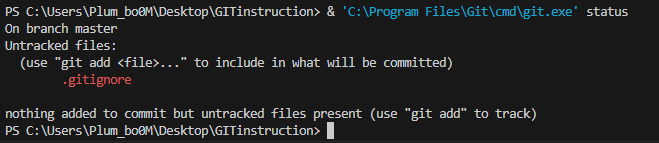
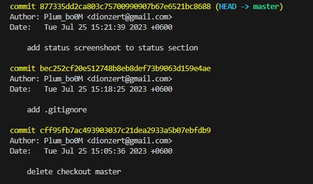

# Инструкция по GIT

* **git init**

* **git status**

* **git add**

* **git commit -m "Message"**

* **git log**

*Команда используется для вывода лога изменений*

1. git log - вывод обычного лога в стандортном представлении

2. git log --graph - вывод лога в графическом представлении с визуализацией веток

* **git checkout**

* **git diff**

* **git branch**

* **git merge**